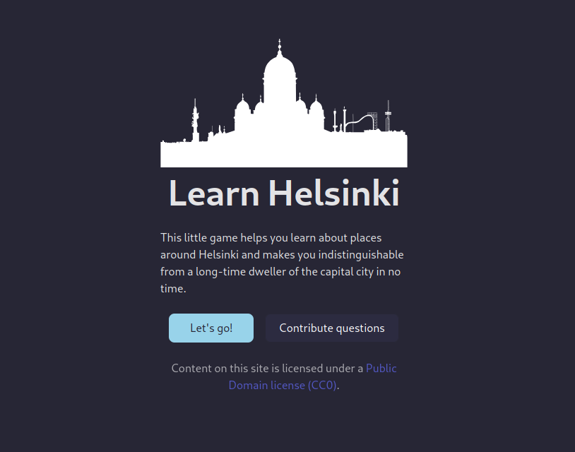
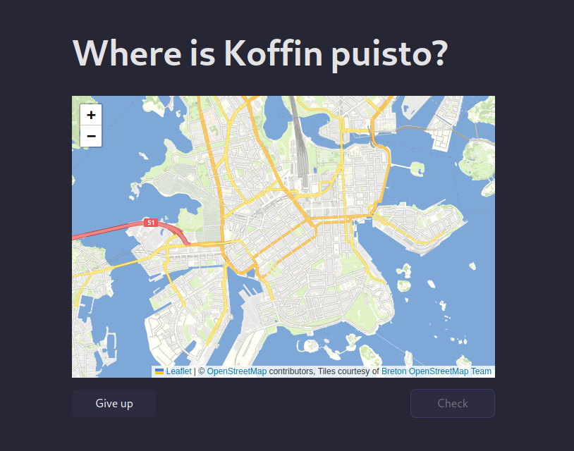

# Learn Helsinki quiz

This game tries to teach you places in helsinki.

* The frontend is written in [solid.js](https://www.solidjs.com/).
* And the backend is my first project in [go](https://go.dev/).
* This project is in super early stage

## Video
[ux.webm](https://github.com/user-attachments/assets/f52509a6-00ee-4b1f-b17a-2c7cf29c2b4a)

## Screenshots

